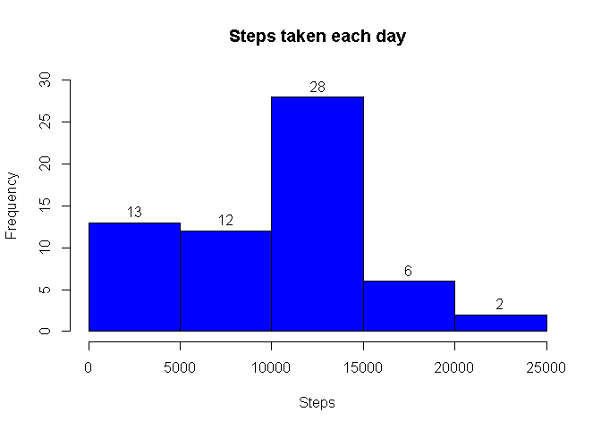
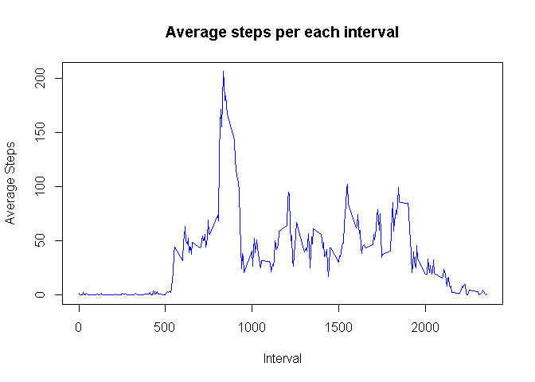
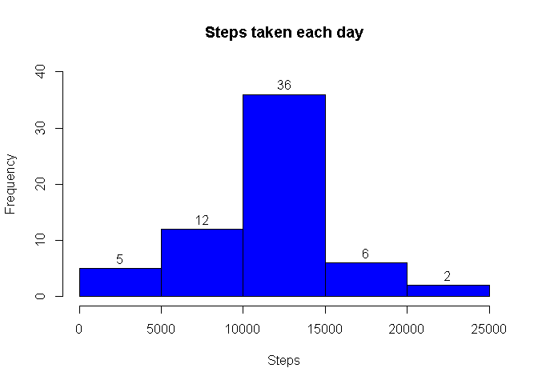
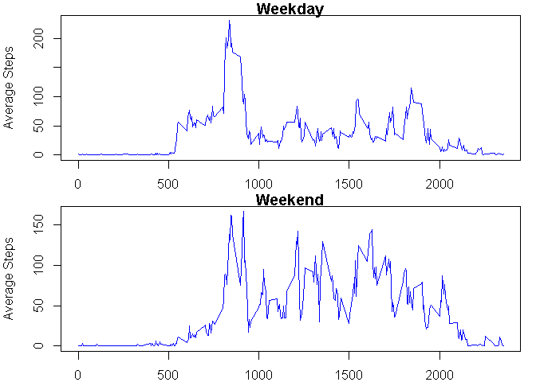

# Reproducible Research: Peer Assessment 1


## Loading and preprocessing the data
 
### Unzip and load the data  

```r
# unzip and read the file
dat <- read.csv(unz("activity.zip", "activity.csv"), header = TRUE, sep = ',')
str(dat)
```

```
## 'data.frame':	17568 obs. of  3 variables:
##  $ steps   : int  NA NA NA NA NA NA NA NA NA NA ...
##  $ date    : Factor w/ 61 levels "2012-10-01","2012-10-02",..: 1 1 1 1 1 1 1 1 1 1 ...
##  $ interval: int  0 5 10 15 20 25 30 35 40 45 ...
```

### Transform the type of date column to Date 

```r
# convert the type of 'date' column to 'date'
dat$date <- as.Date(dat$date, "%Y-%m-%d")
str(dat)
```

```
## 'data.frame':	17568 obs. of  3 variables:
##  $ steps   : int  NA NA NA NA NA NA NA NA NA NA ...
##  $ date    : Date, format: "2012-10-01" "2012-10-01" ...
##  $ interval: int  0 5 10 15 20 25 30 35 40 45 ...
```

## What is mean total number of steps taken per day?

### The total number of steps taken per day

```r
# calculate the sum of steps per day
stepsPerDay <- with(dat, tapply(steps, date, sum, na.rm=TRUE))
```

###  Histogram of the total number of steps taken each day

```r
# draw the histogram of number of steps per day
hist(x=stepsPerDay, xlab='Steps', col='blue', main='Steps taken each day', ylab='Frequency', labels=TRUE, ylim = c(0,30))
```

<!-- -->

### The mean of the total number of steps taken per day

```r
mean(stepsPerDay)
```

```
## [1] 9354.23
```

### The median of the total number of steps taken per day

```r
median(stepsPerDay)
```

```
## [1] 10395
```

## What is the average daily activity pattern?
### A plot of the 5-minute interval (x-axis) and the average number of steps taken, averaged across all days (y-axis)

```r
# claculate the mean of steps per intervals
stepsPerInterval <- with(dat, tapply(steps, interval, mean, na.rm=TRUE))
 
# plot the average steps per interval
plot(x=names(stepsPerInterval), y=stepsPerInterval,type='l', xlab = 'Interval', ylab='Average Steps', main='Average steps per each interval' ,col='blue')
```

<!-- -->

###  The 5-minute interval that contains the maximum number of steps, on average across all the days in the dataset, 

```r
# create new data frame
df = data.frame(names(stepsPerInterval), stepsPerInterval) 
# update the columns namesc
names(df) <- c('interval', 'avgSteps')
# select the row which has the max number of steps 
df[which(df$avgSteps == max(df$avgSteps)), ][[1]]
```

```
## [1] 835
## 288 Levels: 0 10 100 1000 1005 1010 1015 1020 1025 1030 1035 1040 ... 955
```

## Imputing missing values
### The total number of missing values in the dataset

```r
sum(is.na(dat$steps))
```

```
## [1] 2304
```

### We will use the mean for that 5-minute interval to fill the missing data


### Creating a new dataset that is equal to the original dataset but with the missing data filled 
 

```r
# merge the original data frame 'dat' with the the data frame 'df'
mrg <- merge(x=dat, y=df, by.x='interval', by.y='interval')
head(mrg)
```

```
##   interval steps       date avgSteps
## 1        0    NA 2012-10-01 1.716981
## 2        0     0 2012-11-23 1.716981
## 3        0     0 2012-10-28 1.716981
## 4        0     0 2012-11-06 1.716981
## 5        0     0 2012-11-24 1.716981
## 6        0     0 2012-11-15 1.716981
```

```r
# for each row of the mrg data frame,
# if the 'steps' column is null, then put the value of 'avgSteps' in a new column 'mrgSteps' otherwise put the value of 'steps' in the new column 'mrgSteps'  
for(i in 1: nrow(mrg)) {
   
   if(is.na( mrg[i, 'steps'] ))
	{
	  mrg[i, 'mrgSteps'] <- mrg[i, 'avgSteps']
	}
	else
	{
	  mrg[i, 'mrgSteps'] <- mrg[i, 'steps']
	}
}

# Create new data frame which contains only the needed columns
datFilled <- data.frame(mrg$interval, mrg$mrgSteps, mrg$date)

# change the names of the new data frame
names(datFilled) <- c('interval', 'steps', 'date')

head(datFilled)
```

```
##   interval    steps       date
## 1        0 1.716981 2012-10-01
## 2        0 0.000000 2012-11-23
## 3        0 0.000000 2012-10-28
## 4        0 0.000000 2012-11-06
## 5        0 0.000000 2012-11-24
## 6        0 0.000000 2012-11-15
```

### The total number of steps taken per day

```r
# calculate the sum of steps per date
stepsPerDay <- with(datFilled, tapply(steps, date, sum, na.rm=TRUE))
```

###  Histogram of the total number of steps taken each day

```r
# draw the histogram of sum of steps per date
hist(x=stepsPerDay, xlab='Steps', col='blue', main='Steps taken each day', ylab='Frequency', labels=TRUE, ylim = c(0,40))
```

<!-- -->

### The mean of the total number of steps taken per day

```r
mean(stepsPerDay)
```

```
## [1] 10766.19
```

### The median of the total number of steps taken per day

```r
median(stepsPerDay)
```

```
## [1] 10766.19
```
### These values differ from the estimates from the first part of the assignment 
###  Imputing missing data increased the estimates of the total daily number of steps and made the mean and median equal to each other

## Are there differences in activity patterns between weekdays and weekends?

### Create a vector column to distinguish between the weekday and weekend


```r
#create a vector of weekdays
weekdays1 <- c('Monday', 'Tuesday', 'Wednesday', 'Thursday', 'Friday')
#Use `%in%` and `weekdays` to create a logical vector
#convert to `factor` and specify the `levels/labels`
datFilled$wDay <- factor((weekdays(datFilled$date) %in% weekdays1), levels=c(FALSE, TRUE), labels=c('weekend', 'weekday'))
```

### plot the average number of steps for each interval in the weekdays
### plot the average number of steps for each interval in the weekends


```r
# prepare for 2 rows of plot
par(mfrow=c(2,1)) 

#set the margins of the plots
par(mar = c(2, 4, 1, 1))

# calculate the average number of steps for each interval in the weekdays
stepsPerIntervalWeekday <- with(datFilled[which(datFilled$wDay=='weekday'),], tapply(steps, interval, mean, na.rm=TRUE))

# plot the average number of steps against the interval
plot(x=names(stepsPerIntervalWeekday), y=stepsPerIntervalWeekday,type='l', xlab = 'Interval', ylab='Average Steps', main='Weekday' ,col='blue')
 
# calculate the average number of steps for each interval in the weekends
stepsPerIntervalWeekend <- with(datFilled[which(datFilled$wDay=='weekend'),], tapply(steps, interval, mean, na.rm=TRUE))

# plot the average number of steps against the interval
plot(x=names(stepsPerIntervalWeekend), y=stepsPerIntervalWeekend,type='l', xlab = 'Interval', ylab='Average Steps', main='Weekend' ,col='blue')
```

<!-- -->

### The max number of steps in weekdays is more than the max number of steps in weekends
